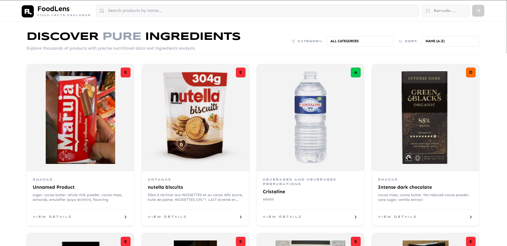
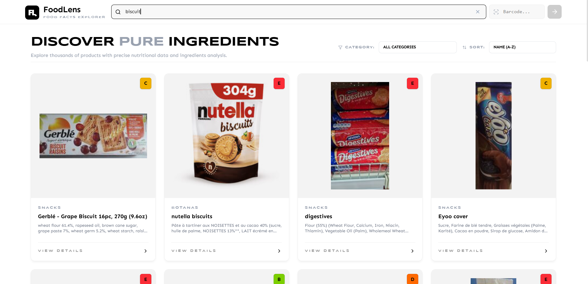
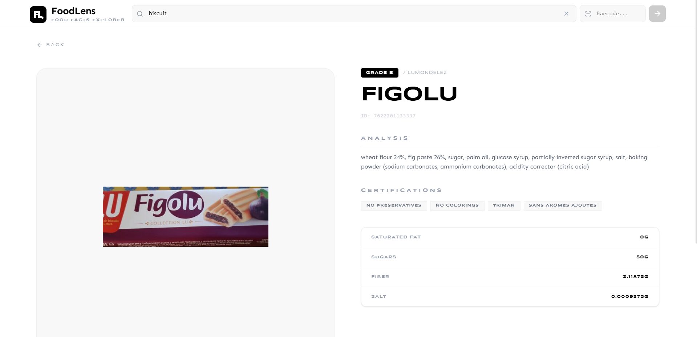

<div align="center">
  

  # FoodLens | Food Facts Explorer

  **Discover Pure Ingredients.**<br>
  A hyper-premium, minimalist React web application designed to instantly surface detailed nutritional data and ingredients analysis via the global *OpenFoodFacts* database.

  [](https://reactjs.org/)
  [](https://vitejs.dev/)
  [](https://tailwindcss.com/)
  [](https://world.openfoodfacts.org/)
</div>

---

## 📸 Interface Sneak Peek

<div align="center">
  
  <br>
  
  <br>
  
</div>

---

## ⚡ Key Features

- 🔎 **Real-time Product Search**: Instant debounced searching against a database of over 3 million food products.
- 🗂️ **Global Category Filtering**: Browse 30+ highly engaged food categories (Beverages, Snacks, Chocolates, etc.) using direct caching mechanisms.
- 📸 **Precise Barcode Lookups**: Type any product barcode for direct nutritional analysis and ingredient text breakdown.
- 🌓 **Premium Light-Mode UI**: A heavily customized stark-white design system utilizing `glassmorphism`, `Syncopate` headers, and `Sen` typography.
- 🌐 **Anti-CORS Architecture**: Leverages local Vite proxying to cleanly intercept and route API calls, entirely bypassing browser-level CORS errors and throttling blocks.
- 🌍 **Intelligent Localization**: Automatically prioritizes English-translated database labels for global products, falling back natively when unavailable.

---

## 🛠️ Technology Stack

| Technology | Purpose |
| ---------- | ------- |
| **React** (Vite) | High-performance frontend rendering & Hot-Module-Replacement. |
| **TailwindCSS** | Core styling utility, defining entire monochrome aesthetic system. |
| **Lucide-React** | Minimalist, beautifully proportionate SVG icon set. |
| **Context API** | Pure React-native global state mechanism (managing search, feeds, loading, and cursors). |
| **Fetch API** | Asynchronous promise-driven data handling mapped dynamically to custom proxy routes. |

---

## 🚀 Quick Start Guide

### Prerequisites
- Node.js `v18.x` or later.
- `npm` or `yarn` installed.

### 1. Installation
Clone the repository and install all dependencies:
```bash
git clone https://github.com/your-username/FoodLens.git
cd FoodLens
npm install
```

### 2. Run the Development Server
Since the OpenFoodFacts API requires specific headers and throttles generic anonymous browsers, we run all requests through a safe Local Vite Proxy.

Start the app:
```bash
npm run dev
```

Your server will boot. Open [http://localhost:5173/](http://localhost:5173/) to explore the application!

---

## 🔌 API Integration Details

The application consumes data entirely from the **OpenFoodFacts API**.

To guarantee uptime and completely avoid Cross-Origin Resource Sharing (CORS) exceptions, `vite.config.js` acts as an intermediary. 
- **Product Text Search** (`/cgi/search.pl`): Executed on the legacy core infrastructure to guarantee high-accuracy name hits.
- **Categorization** (`/api/v2/search`): Routes natively across the faster `.net` architecture using the `categories_tags` query.
- **Entity Resolution** (`/api/v0/product`): Fetches precise ID-matched datasets.

*A custom un-throttled User-Agent is securely injected server-side to guarantee prioritized request streaming.*

---

## 📁 Source Architecture
```
src/
├── components/          # Reusable view components 
│   ├── SearchBar.jsx
│   ├── CategoryFilter.jsx
│   ├── ProductCard.jsx  # Grid interface components
│   └── Navbar.jsx       # Persistent reset & layout binding
├── pages/
│   ├── HomePage.jsx             # The master list and dynamic paginator
│   └── ProductDetailPage.jsx    # Deep-dive nutritional tabular pages
├── context/
│   └── FilterContext.jsx        # App-wide global state registry
├── utils/
│   └── api.js                   # Primary promise-wrapper for OpenFoodFacts
├── App.jsx                      # Primary React Router bindings
└── index.css                    # Tailwind Directives and CSS-Variable System
```

---

<div align="center">
  <i>Engineered for the 1% Web Aesthetic | Minimal. Bold. Functional.</i>
</div>
